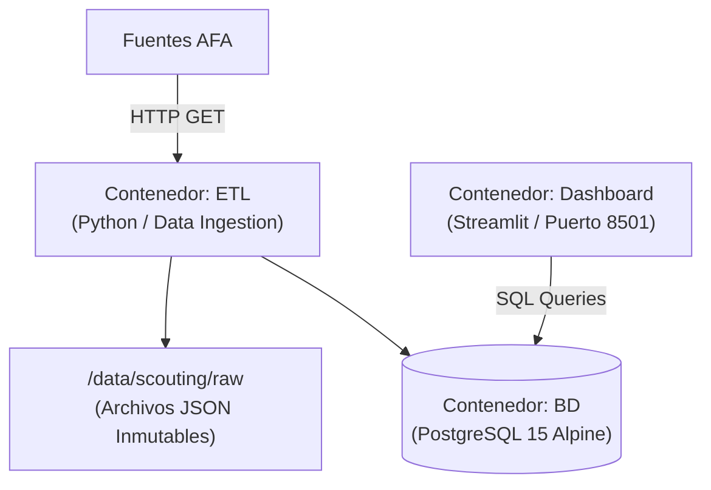

# MoneyBall Argentino / Argos

Plataforma integral de ingeniería de datos, almacenamiento estructurado y análisis deportivo aplicada al fútbol argentino (Primera División).

---

## 1. Visión y Objetivos del Proyecto

* **Objetivo Técnico:** Diseñar un pipeline de datos robusto, reproducible e idempotente ejecutado sobre un servidor local dedicado (Argos), aplicando buenas prácticas de desarrollo en Linux, Docker, Python y PostgreSQL.
* **Objetivo de Dominio / Scouting:** Ingerir, normalizar y explotar datos del fútbol argentino para responder preguntas tácticas y de mercado (detección de talento sub-23, métricas de rendimiento por 90 minutos y comparativas directas entre jugadores).

---

## 2. Arquitectura del Sistema

El sistema se ejecuta como una plataforma multicontenedor orquestada mediante Docker Compose (versión de especificación 3.8).



---

## 3. Especificación de Contenedores

| Servicio / Contenedor | Stack Base | Puerto | Rol y Responsabilidades |
| :--- | :--- | :--- | :--- |
| **etl** | Python 3.11+ / httpx / pydantic / sqlalchemy | N/A (Worker / CLI) | - Realiza fetch hacia los endpoints de AFA.<br>- Guarda respuestas crudas e inmutables con timestamp en `/data/scouting/raw`.<br>- Ejecuta validaciones de contrato de datos (Data Contracts).<br>- Transforma y aplana estructuras anidadas a esquemas relacionales.<br>- Inserta/actualiza datos de forma idempotente (Upsert) en PostgreSQL. |
| **db** | PostgreSQL 15 Alpine | 5432 (Interno) | - Persiste la capa analítica (Silver Layer).<br>- Almacena tablas normalizadas (players, teams, stats).<br>- Mantiene índices optimizados (btree) para consultas analíticas de baja latencia.<br>- Guarda el payload original en columnas JSONB para auditoría y trazabilidad. |
| **dashboard** | Streamlit / Python | 8501:8501 | - Consume vistas y consultas SQL optimizadas desde PostgreSQL.<br>- Expone visualmente métricas de scouting (filtros por edad, posición, métricas por 90 min).<br>- Proporciona la interfaz interactiva para análisis exploratorio. |

---

## 4. Estructura de Directorios en Argos

```text
/data/scouting/
├── raw/                     # Snapshots inmutables de JSONs/HTMLs descargados
│   └── playersStatsFull_20260823T150000Z.json
├── processed/               # Archivos intermedios limpios (si aplica)
└── database/                # Volúmenes persistentes de PostgreSQL (montaje Docker)

moneyball-argentino/         # Repositorio Git del proyecto
├── docker-compose.yml
├── .env.example
├── README.md
├── etl/
│   ├── Dockerfile
│   ├── requirements.txt
│   └── src/
│       ├── extract.py       # Descarga y guardado raw
│       ├── schemas.py       # Modelos Pydantic para validación
│       ├── transform.py     # Lógica de aplanado y tipado
│       └── load.py          # Conexión y Upsert en PostgreSQL
└── dashboard/
    ├── Dockerfile
    ├── requirements.txt
    └── app.py               # Aplicación e interfaz Streamlit
```

---

## 5. Pipeline de Ejecución del ETL

1. **Extract:** Descarga el endpoint de AFA (ej. playersStatsFull.json), calcula hash de integridad y escribe el archivo crudo en /data/scouting/raw/.
2. **Contract Validation:** Pydantic valida la estructura del payload para prevenir inconsistencias en la base de datos si la fuente remota cambia sus campos.
3. **Transform:** Desanida objetos (name.first, name.last), castea fechas a DATE, maneja valores nulos y estandariza unidades (height_cm, weight_kg).
4. **Load:** Ejecuta operaciones de inserción/actualización basadas en player_id mediante cláusulas ON CONFLICT (player_id) DO UPDATE.